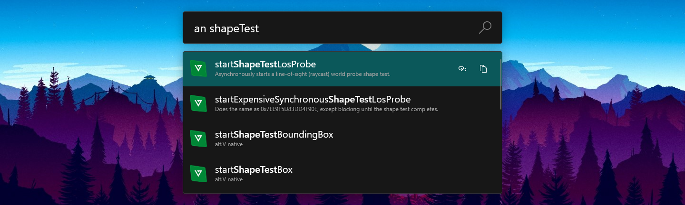

# PowerToys Run alt:V natives plugin

Searches alt:V native db reference in PowerToys Run. 

## Usage

* Default search prefix: `an` (can be changed in settings)
* `Enter` opens new tab in browser with the native
* `Ctrl + Enter` copies link to the native to the clipboard
* `Shift + Enter` copies native name to the clipboard
* `Ctrl + Shift + Enter` copies capitalized native name to the clipboard

## Installation

* Download [latest release](https://github.com/zziger/altv-powertoys-run-natives/releases/latest) from GitHub (AltVNatives.zip)
* Stop PowerToys
* Unpack the zip into `%ProgramFiles%\PowerToys\modules\launcher\Plugins`
* Start PowerToys